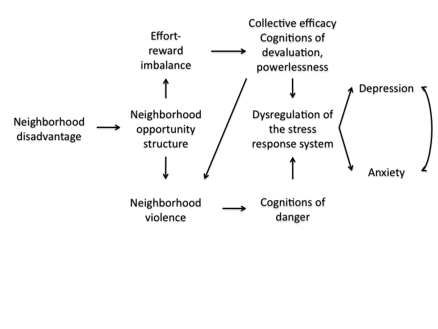
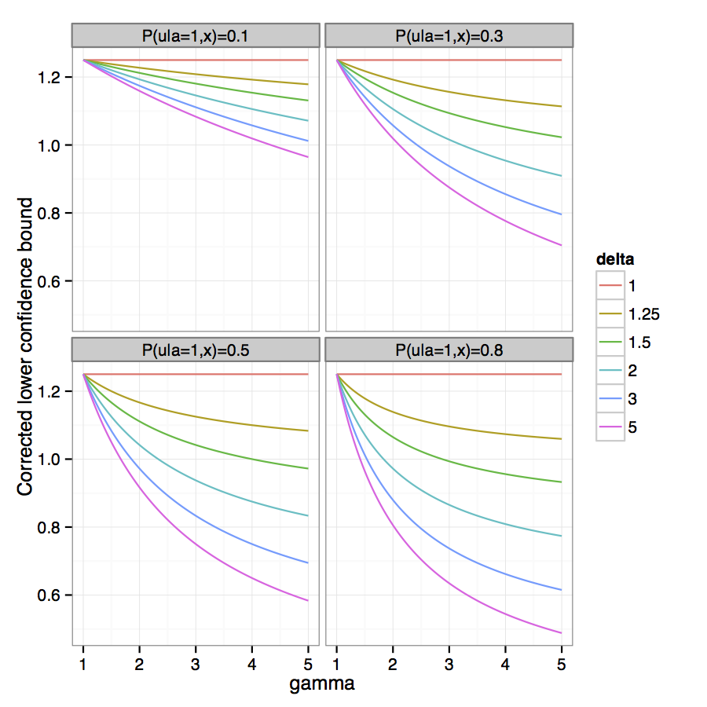
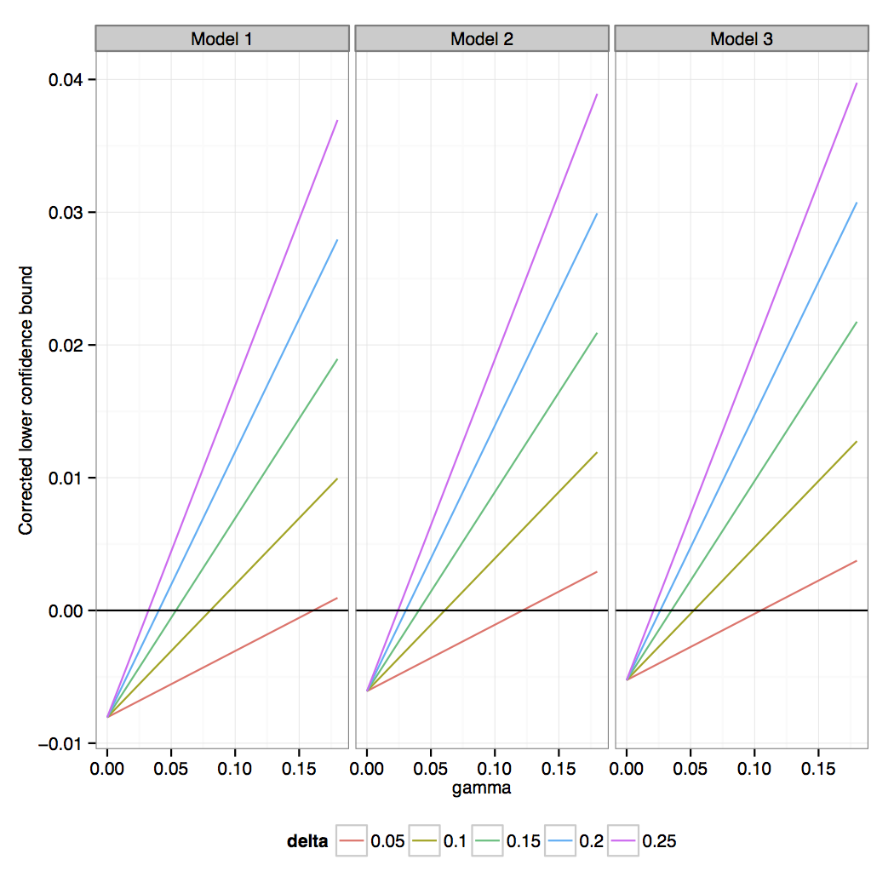
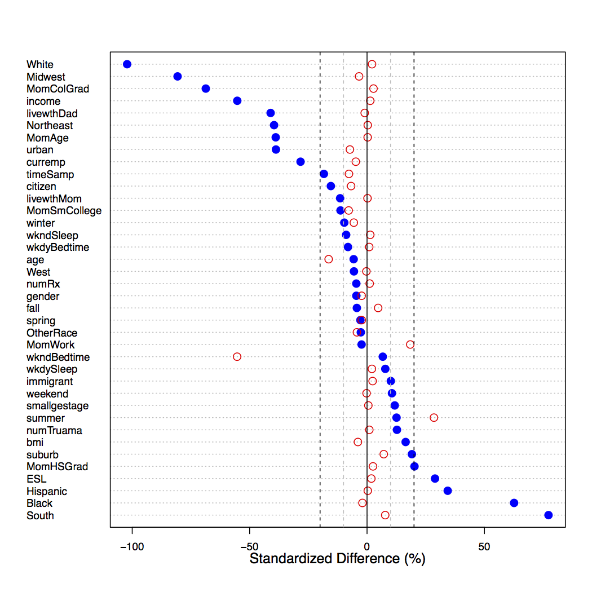
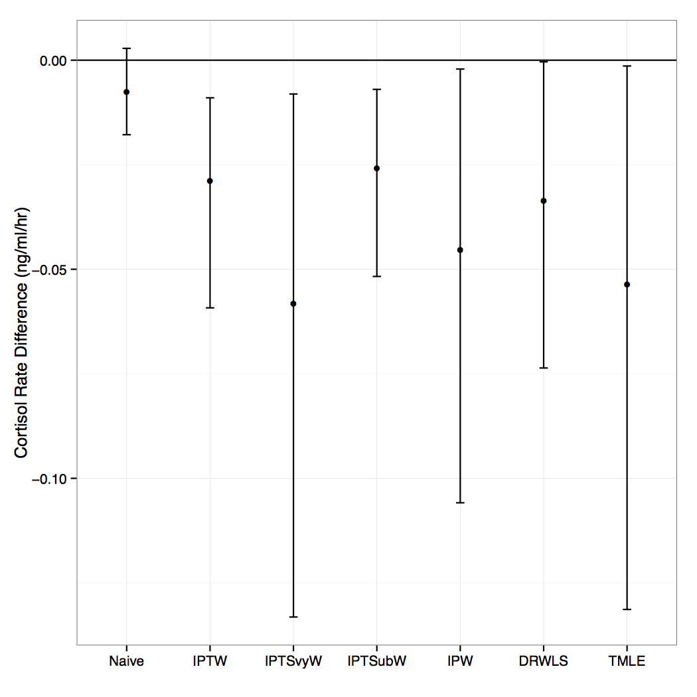

## Conceptual Framework
<!---
as i go thgouth and show ho w i tried to address these things in the dissertation, it may be helpful to see how i envision the relationship between living in a disadvantaged neighborhood and mental illness. 
ND itself is not risk factor for poor mental health, but is thought to instead be a proxy for specific neighborhood features tha are risk factors. collective efficacy and violence are two such niehgborhood features that have strong evidence bases. 
I think in between those could come something that sociologist William Julius Wilson calls “neighborhood opportunity structure.” Disadvantaged neighborhoods “offer few legitimate employment opportunities, inadequate job information networks, and poor schools” and residents “lack contact or sustained interaction” with local institutions, individuals in the formal labor market, and individuals with some college education.
In support of this, 2 quasi experimental studies, one in chicago and one in new york , found that adults who moved to low-income neighborhoods were more likely to be employed.

Regarding the upper portion of the conceptual model, a lack of neighborhood opportunity structure may create an effort-reward imbalance, because legitimate efforts by residents of low-opportunity neighborhoods to improve their situation (effort) are likely to be ineffective (lack of reward), because of the “systematic blockage of opportunities"." Research suggests that an effort-reward imbalance results in individuals feeling powerless, with little motivation and self-esteem, --effectly stymying collective effecacy- 

these qualities have been shown to be predictive of dysregulation of the stress response system in both humand and primates. and are also predictive of reduced hippocampal volume and depression. 

Regarding the lower portion of the conceptual model, low collective efficacy has been shown to be associated with increased community violence. In addition residents of neighborhoods with low opportunity structure are likely to be unemployed and/or out of the labor force, which increases the “likelihood that the residents will rely on illegitimate sources of income.” Because these illegitimate methods may be a target for police, this may also act to increase neighborhood violence.

The possibility of threat in violent neighbrhoods results in repeated or prolonged activation of the stress response system,  This association between neighborhood violences and markers of dysregulation of the stress response system has been shown by severl research groups. 

dysregulation of the stress response system--and in particular, cortisol dysregulation and elevated levels are associated with depression. Cortisol levels actually remain elevated for the duration of the major depressive episode, and have been shown to reduce hippocampal volume. This reduced hippocampal volume has also been associated with anxiety disorders like PTSD

**maybe don't say this next part
Underscored by the example of cushings disease
Cushing’s caused by a tumor on the pituitary glad resulting in high levels of cortisol 
cognitive e↵ects such as increased risk of major depression and anxiety disorders, metabolic e↵ects such as central obesity and diabetes, immune e↵ects such as increased risk for infection, and cardiovascular e↵ects such as hypertension and heart disease. [8
Cushing’s disease is e↵ectively treated by removing the tumor, which allows cortisol levels to return to normal. [98]
-->

---

## Exposure

### What do we mean by neighborhood disadvantage? 
* Formulated by Diez-Roux et al (2001) and used in multiple epidemiologic studies.
* Measured at the Census tract level
* Composite measure of 6 Census indicators: 
  1. log median household income 
  2. percent households with interest, dividend, or rental income
  3. log median value of housing units
  4. percent persons over age 25 with high school degree
  5. percent persons over age 25 with college degree
  6. percent persons in executive, managerial, or professional specialty occupations

---

## Aim 1: Outcome

### What do we mean by prevalent emotional disorder? 
* Determined by Composite International Diagnostic Interview modified for adolescents
* Corresponds to _DSM-IV_ and _ICD-9_ diagnoses

In the past 12 months at least one of the following:

1. Anxiety disorder 
  * panic
  * phobia (specific, social, agoraphobia)
  * separation anxiety
  * generalized anxiety
  * post-traumatic stress disorder) 
  
2. Major depressive disorder or dysthymia

--- 

## Aim 1: Effect Modifier

### What do we mean by urbanicity? 
* Census-derived categories
  1. large-mid-sized urban center 
  2. urban fringe
  3. non-urban

--- &twocol

## Aim 1: Sensitivity Analyses

*** left

* Measurement variance $\rightarrow$ sensitivity analysis using factor scores obtained by multiple-group confirmatory factor analysis.
* Unobserved confounding $\rightarrow$ bias equations (VanderWeele and Arah, 2011)
  * Setting the conditional probability of a given unobserved confounder to 80% in disadvantaged neighborhoods, the unobserved confounder would need to be 2$\times$ as prevalent in disadvantaged neighborhoods and be associated with 1.4$\times$ greater odds of prevalent depression/ anxiety to change our inference.

*** right

--- 

## Aim 2: Outcome

### What do we mean by cortisol?
* Saliva sample taken immediately before and after face-to-face interview in adolescent's home.
* Measured by radioimmunoassay
  * Sensitivity=0.0165 ng/mL
	* Intra- and inter-assay coefficients of variation: 5.4%, 26.0%

---

## Aim 2: Sensitivity Analyses

### Decision to exclude current smokers and drug users
Model |  Pre  |  Post  |  Rate (ng/mL/hr $×10^{-2}$)
---|-----------------|-----------------|----------------
Current smokers and drug users excluded | | | 
Model 1 |  1.19 (1.05, 1.34)  |  0.96  (0.85, 1.07)  |  -2.47 (-4.13, -0.81)  
Model 2 |  1.15 (1.00, 1.31)  |  0.96  (0.86, 1.07)  |  -2.38 (-4.14, -0.61)  
Model 3 |  1.13 (0.99, 1.28)  |  0.95  (0.85, 1.06)  |  -2.20  (-3.87, -0.52)  
Current smokers excluded, drug users included  |  |  |
Model 1 |  1.16 (1.01, 1.33)  |  0.94  (0.84, 1.07)  |  -2.30  (-3.89, -0.72)  
Model 2  |  1.13 (0.97, 1.32)  |  0.95  (0.85, 1.06)  |  -2.21 (-3.95, -0.47) 
Model 3 |  1.11  (0.95, 1.28)  |  0.94  (0.84, 1.05)  |  -2.03 (-3.68, -0.38) 
Current smokers and drug users included |  |  |
Model 1  |  1.11 (0.96, 1.27)  |  0.96  (0.84, 1.10)  |  -1.77  (-3.36, -0.18)  
Model 2 |  1.08 (0.92, 1.26)  |  0.97 (0.86, 1.10)  |  -1.62  (-3.34, 0.10) 
Model 3 |  1.06 (0.92, 1.23)  |  0.96  (0.86, 1.08)  |  -1.44  (-3.14, 0.27) 

--- &twocol

## Aim 2: Sensitivity Analyses

### Unobserved confounding.

*** left

* Because exposure is not randomized, the association could be an artifact of unobserved confounding.
  * Moderately sensitive. Setting the conditional probability of a given unobserved confounder to be 20% greater in a disadvantaged versus nondisadvantaged neighborhoods, the unobserved confounder would have to bias the conditional mean cortisol slope by 98% to change our inference.

*** right

<!---
In addition, 
We repeated our analysis using the 25th, 20th, 15th, 10th, and 5th percentile as cut-points. The disadvantage, though, is that our the sample size in our matched datasets gets progressively smaller with each smaller cutpointThe association between neighborhood disadvantage and cortisol slope remained significant for all cut-points except the 5th percentile. could be because the sample size of the matched dataset was greatly reduced in this case (from N=867 to N=148 for the first imputation).
-->

---

## Aim 3: Analysis
### Estimand
Population average treatment effect: $E(Y_1 - Y_0)$

Identification: $E(Y_1 - Y_0) = \frac{E[w^{\Delta_{svy}=1}(\mu(1,\mathbf{W})-\mu(0,\mathbf{W})) \vert \Delta_{svy}=1]}{E(w^{\Delta_{svy}=1} \vert \Delta_{svy}=1)}$

where $\mu(a, \mathbf{W})$ is the regression function of the outcome on covariates among those in the subsample with treatment $A=a$

---

## Aim 3: Analysis
### IPW
$$\begin{equation*} \begin{aligned}
w^{A=1, \Delta_{svy}=1, \Delta_{sub}=1} &= \frac{I(\Delta_{svy}=1)}{P(\Delta_{svy}=1 \vert \mathbf{W})} \times \frac{I(A=1)}{P(A=1) \vert \Delta_{svy}=1, \mathbf{W})}\\ &\times \frac{I(\Delta_{sub}=1)}{P(\Delta_{sub}=1 \vert A=1, \Delta_{svy}=1, \mathbf{W})} \\ 
&= \frac{I(A=1, \Delta_{sub}=1, \Delta_{svy}=1)}{P(A=1,\Delta_{sub}=1, \Delta_{svy}=1 \vert \mathbf{W})} \\
w^{A=0, \Delta_{svy}=1, \Delta_{sub}=1} &= \frac{I(\Delta_{svy}=1)}{P(\Delta_{svy}=1 \vert \mathbf{W})} \times \frac{I(A=0)}{P(A=0) \vert \Delta_{svy}=1, \mathbf{W})} \\
& \times \frac{I(\Delta_{svy}=1)}{P(\Delta_{sub}=1 \vert A=0, \Delta_{svy}=1, \mathbf{W})} \\ 
&= \frac{I(A=0, \Delta_{sub}=1, \Delta_{svy}=1)}{P(A=0,\Delta_{sub}=1, \Delta_{svy}=1 \vert \mathbf{W})} \end{aligned} \end{equation*}$$

---

## Aim 3: Analysis
### DRWLS

1.  Use $w^{\Delta_{sub}=1, A=a, \Delta_{svy}=1}$ in a WLS regression outcome model. Using G-computation, predict counterfactual outcomes from WLS, standardized to the survey sample.
2.  Use the counterfactual outcomes to estimate the marginal mean effect in the survey sample.
3.	Weight this estimate by the survey weights to estimate the marginal mean effect in the population.

---

## Aim 3: Analysis
### TMLE

1.  Obtain predicted values of the outcome conditional on the treatment and covariates.
2.	Estimate coefficients for the vector of clever covariates $w^{\Delta_{sub}=1, A=a, \Delta_{svy}=1}$  via regression with $Y$ as the outcome and using $\hat{Y}^0$, the initial predicted values of the conditional outcome, as an offset.
3.	Update $\hat{Y}^0$ by the estimated coefficient multiplied by the clever covariate. Extract predicted counterfactual outcome values for each individual in the survey sample using G-computation. Weighting the predicted individual treatment effects by the survey weights, compute the marginal mean effect estimate for the population.

---

## Aim 3: Analysis
### TMLE
$$\begin{equation*} \begin{aligned}
\hat{\psi} &= \frac{\frac{1}{n}\sum\limits^{n}_{i=1}\frac{1}{\pi(W_{1i})} (\mu^1(1, X_i) - \mu^1(0, X_i))}{\frac{1}{n}\sum\limits^{n}_{i=1}\frac{1}{\pi(W_{1i})}}\\
\text{where  } \mu^1(A, X_i) &= logit^{-1}\bigg[logit(\hat{mu}^0(A, X_i)) + \hat{\epsilon}\frac{(2A-1)\Delta_{sub}}{\pi(W1)\hat{g}(A,X)} \bigg]\\
\text{and  } \frac{1}{\pi(W_1)} &= \frac{1}{P(\Delta_{svy}=1 \vert W_1)}\\
\text{which solves  } \hat{D}(O) &= \frac{1}{\pi(W_1)}\bigg[\frac{(2A-1)\Delta_{sub}}{\hat{g}(A,X)}(Y - \hat{\mu}^1(A,X) + \hat{\mu}^1(1,X) - \hat{\mu}^1(0,X) - \hat{\psi}) \bigg]
\end{aligned} \end{equation*}$$

--- &twocol

## Aim 3: Results
<!---
We then applied these methods to our example from Aim 2. 
Figure on teh left shows in red dots the extent to which (1) NCS-A participants with cortisol mea- surements compare to participants without across possible confounding variables (red, open dots), and (2) NCS-A participants with the exposure of interest (residence in a disadvantaged neighborhood) compare to participants without (blue, closed dots). 

participants living in disadvantaged neighborhoods di↵er from those living in non-disadvantaged neighborhoods in terms of expected demo- graphic variables like race, income, and maternal education.
Those with and without cortisol measurements look similar with the exceptions of age, average bedtime on the weekends, maternal work, and the interview taking place in the summer. So if we did what was usually done in the literature, we would ignore selection into the sub-sample

Figure on teh right, shows our results
on the y axis, we see the difference in cortisol slope. 
on the x axis we have the different estimators
First, if we comare the two IPW estimators. one which does not adjust for sub-sample selection, since we didn't see big differences, IPTSvyW, and the one that does ajudst, IPW, we see that the IPW estimate is 22% larger. So in this case, even though we didn't see any big differences in the one-dimensional summary, a 22$ difference may still matter.
focusing on teh 3 estimators that address non-random tx assignment as well as selection into the survey and sub-sample (IPW, DRWLS and TMLE), we see that we get the same inference no matter which estiamtor we choose. 
In the simulation, DRWLS and TMLE performed better than IPW in terms of % bias, efficiancy, coverage and MSE. Here, though, surprisingly TMLE has a wider CI than IPW. This discrepancy likely stems from more unstable weights and practical positivity violations with the case study data. And remains us that there is a need for caution using any of these estimators in this case.
-->
*** left

*** right

---

## Aim 3: Results

* No noticeable penalty for overadjusting. 

### Sensitivity Analyses

* Truncate weights at 99th percentile 
* Simplify from two-stage to one-stage selection process
* Strengthening and weakening the relationship between $W_1$ and selection 
* **$W$** associated with both probability of treatment and probability of selection 
* No EH, binary EH
* No change in relative performance under correct model specification
